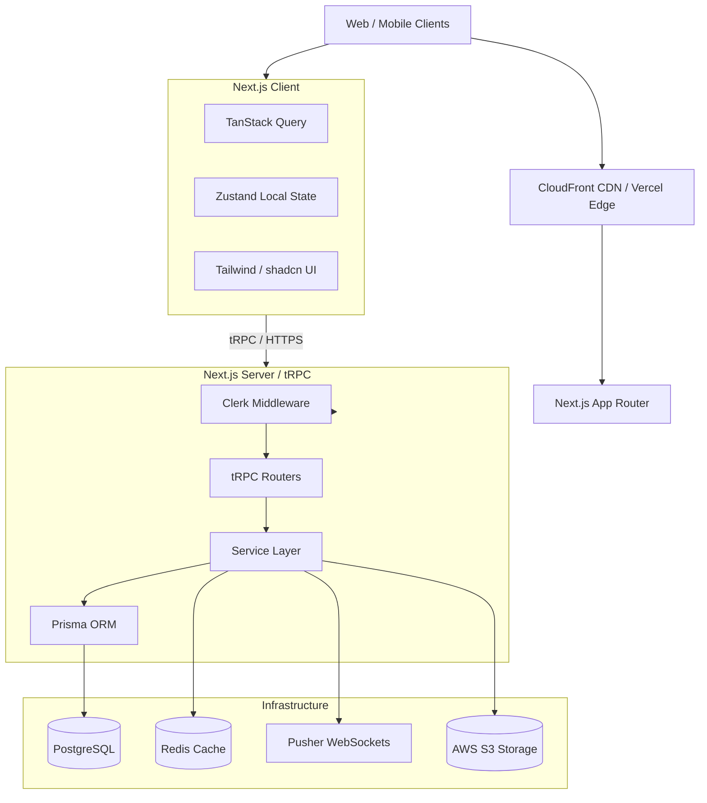

# System Architecture

AcademySphere follows a Cloud-Native Modular Monolith architecture, preparing for eventual transition into a full Monorepo (Turborepo).

## High-Level Architecture Flow



## Core Principles

1. **Modular Monolith**: We enforce strict boundaries between features (e.g., `features/billing`, `features/tournaments`) to allow for future extraction, but deploy as a single cohesive unit for now.
2. **Serverless-Ready**: The backend is designed to run in serverless functions (Vercel) or containerized environments (AWS Fargate) statelessly. In-memory state is forbidden for business-critical data.
3. **Type-Safety**: End-to-end type safety from the Database (Prisma) to the API (tRPC) to the UI components (React).

## Monorepo Target Structure
*(Migration strategy documented in decisions)*
```
academysphere/
├── apps/
│   ├── web/ (Next.js Application)
│   ├── api/ (tRPC / Node API)
│   └── mobile/ (React Native / Expo)
├── packages/
│   ├── ui/ (Shared Tailwind/shadcn components)
│   ├── types/ (Shared TypeScript interfaces)
│   ├── validation/ (Zod schemas)
│   └── database/ (Prisma schema & client)
```
