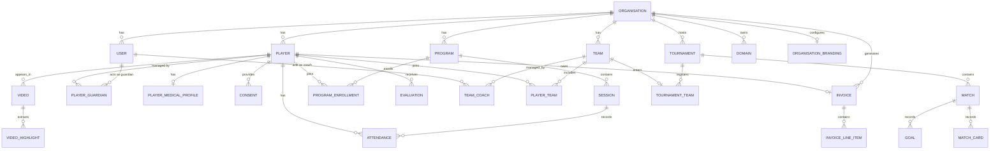

# AcademySphere Database ERD

This document provides a high-level Entity Relationship Diagram (ERD) of the core AcademySphere multi-tenant database.

```mermaid
erDiagram
    ORGANISATION ||--o{ USER : has
    ORGANISATION ||--o{ PLAYER : has
    ORGANISATION ||--o{ TEAM : has
    ORGANISATION ||--o{ PROGRAM : has
    ORGANISATION ||--o{ TOURNAMENT : hosts
    ORGANISATION ||--o{ INVOICE : generates
    ORGANISATION ||--o{ DOMAIN : owns
    ORGANISATION ||--o| ORGANISATION_BRANDING : configures

    USER ||--o{ PLAYER_GUARDIAN : "acts as guardian"
    PLAYER ||--o{ PLAYER_GUARDIAN : "managed by"
    PLAYER ||--o| PLAYER_MEDICAL_PROFILE : has
    PLAYER ||--o{ CONSENT : provides
    
    PROGRAM ||--o{ SESSION : contains
    PROGRAM ||--o{ PROGRAM_ENROLLMENT : enrolls
    PLAYER ||--o{ PROGRAM_ENROLLMENT : joins

    SESSION ||--o{ ATTENDANCE : records
    PLAYER ||--o{ ATTENDANCE : has
    PLAYER ||--o{ EVALUATION : receives

    TEAM ||--o{ TEAM_COACH : managed_by
    USER ||--o{ TEAM_COACH : "acts as coach"
    TEAM ||--o{ PLAYER_TEAM : includes
    PLAYER ||--o{ PLAYER_TEAM : joins
    
    TOURNAMENT ||--o{ MATCH : contains
    TOURNAMENT ||--o{ TOURNAMENT_TEAM : registers
    TEAM ||--o| TOURNAMENT_TEAM : enters
    
    MATCH ||--o{ GOAL : records
    MATCH ||--o{ MATCH_CARD : records
    
    PLAYER ||--o{ VIDEO : appears_in
    VIDEO ||--o{ VIDEO_HIGHLIGHT : extracts
    
    INVOICE ||--o{ INVOICE_LINE_ITEM : contains
    PLAYER ||--o| INVOICE : owes
```
